# Diagramas Visuais dos Autômatos - Compilador CF

Este documento contém diagramas em formato Mermaid que podem ser visualizados no GitHub, VSCode ou outras ferramentas compatíveis.

## 📊 Como Visualizar

- **GitHub/GitLab**: Os diagramas são renderizados automaticamente
- **VSCode**: Instale a extensão "Markdown Preview Mermaid Support"
- **Online**: Use https://mermaid.live/

---

## 1. Autômato Principal do Lexer

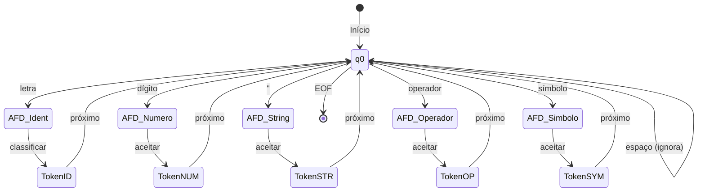

---

## 2. AFD para Identificadores

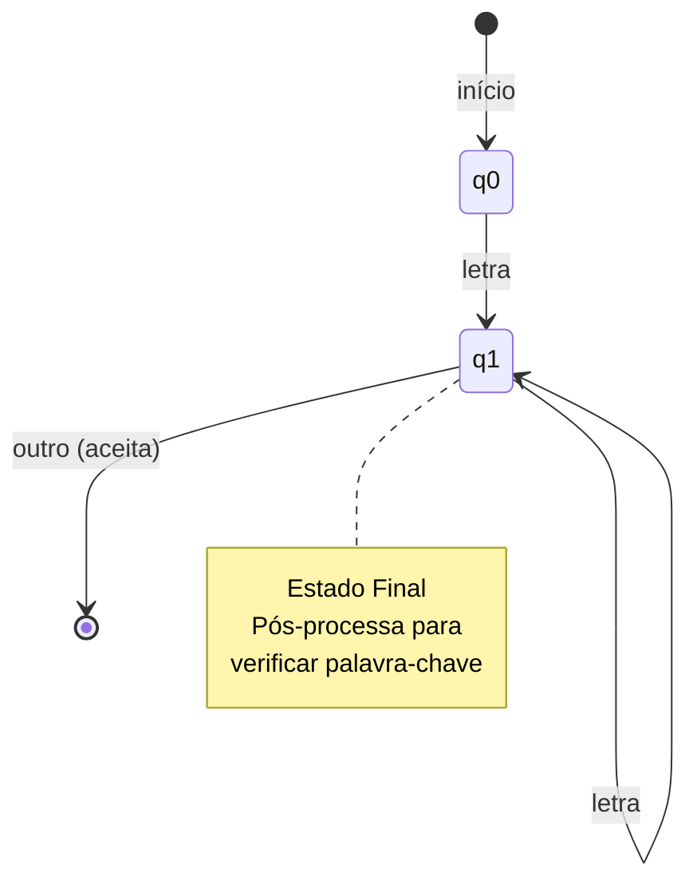

---

## 3. AFD para Números Inteiros

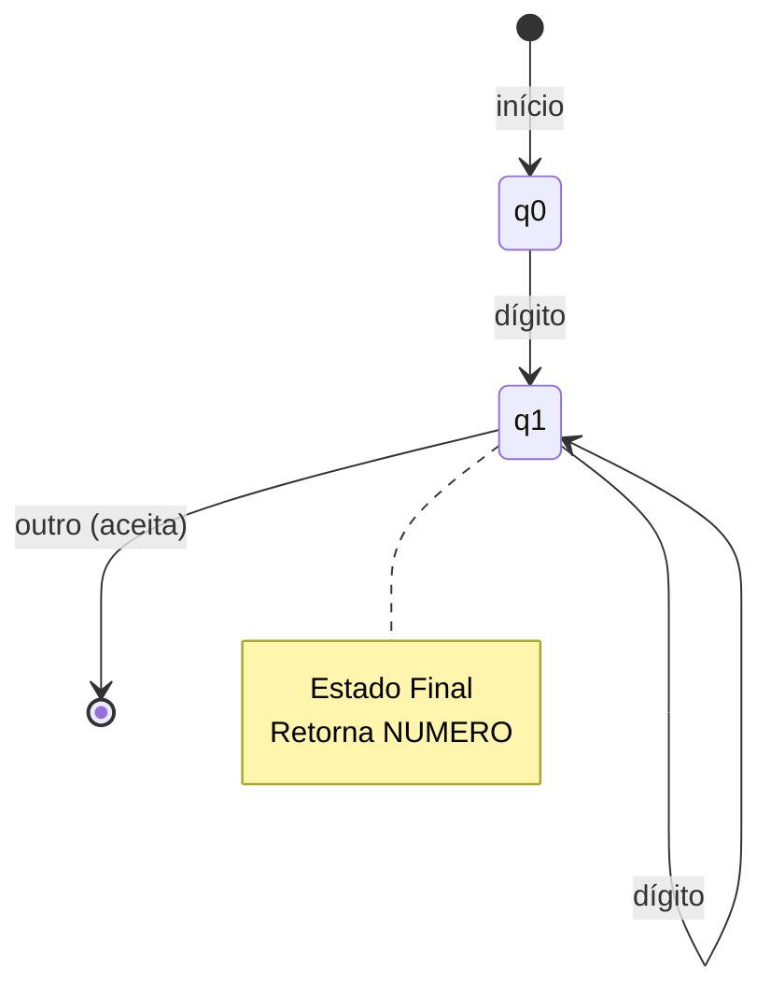

---

## 4. AFD para Strings Literais

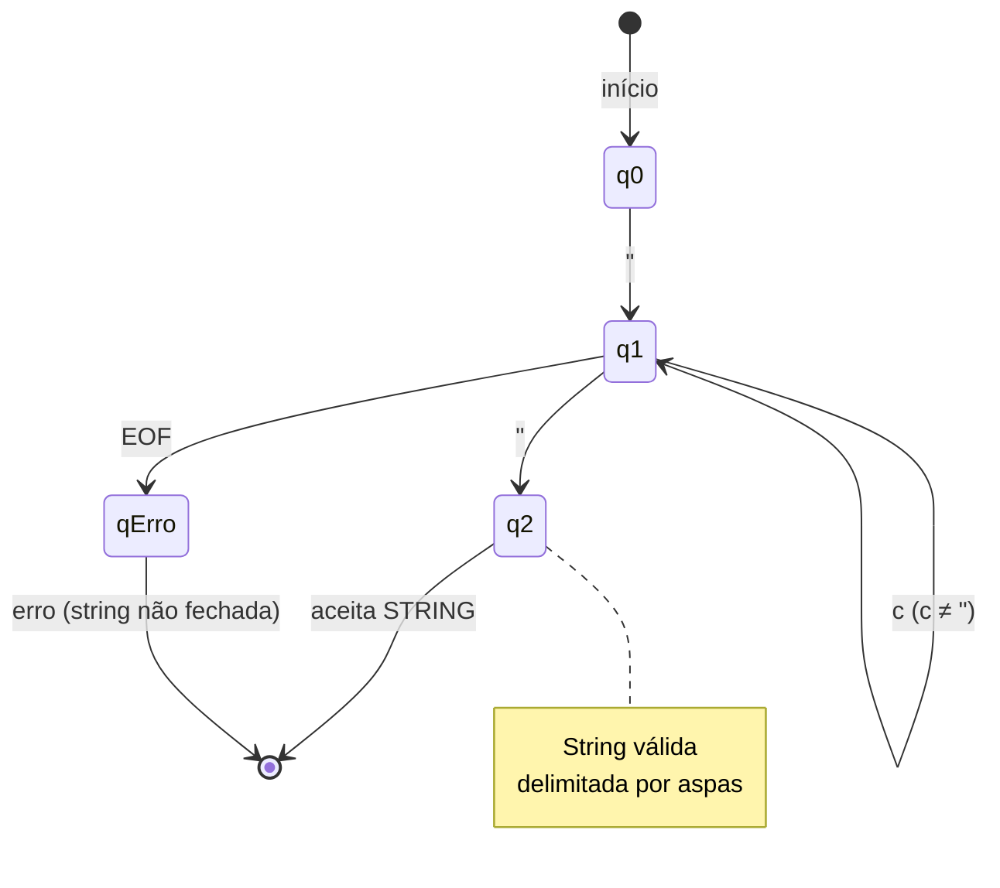

---

## 5. AFD para Comentário de Linha ($)

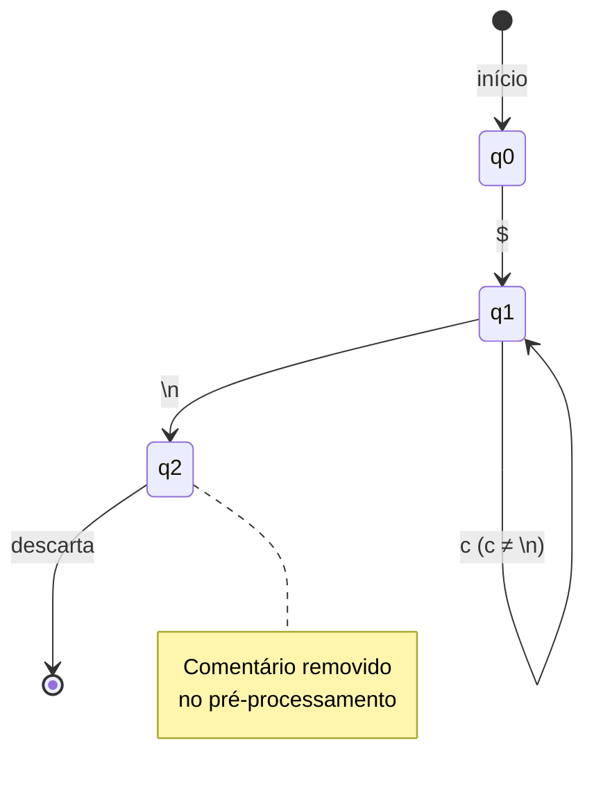

---

## 6. AFD para Comentário de Bloco ($$)

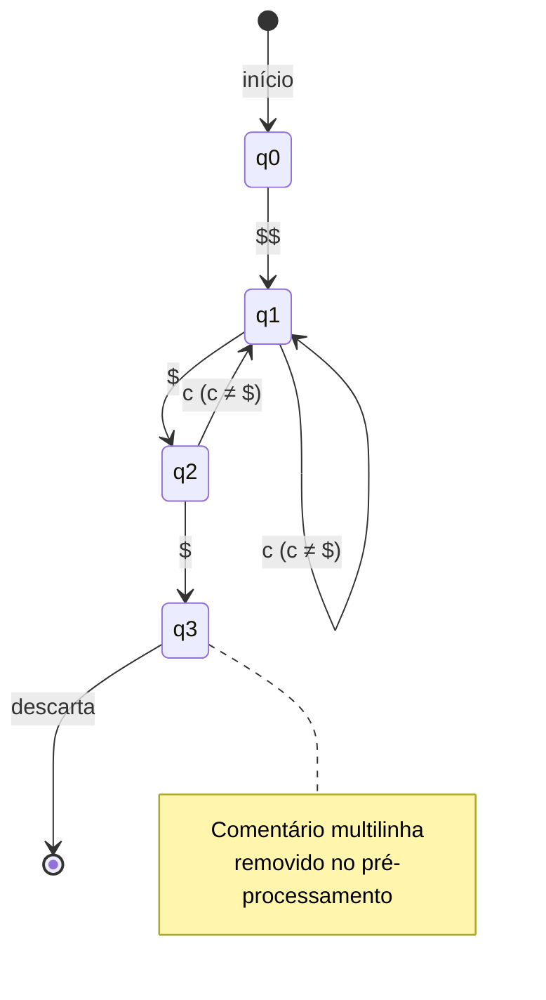

---

## 7. AFD para Operadores de 2 Caracteres

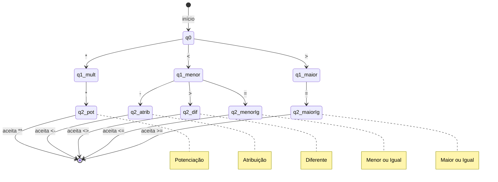

---

## 8. Diagrama de Fluxo do Processo de Tokenização

```mermaid
flowchart TD
    A[Código Fonte] --> B[Pré-processamento]
    B --> C{Remove Comentários}
    C -->|$...| D[Remove linha]
    C -->|$$...$$ | E[Remove bloco]
    D --> F[Código Limpo]
    E --> F
    
    F --> G[Análise Léxica]
    G --> H{Próximo Caractere}
    
    H -->|Letra| I[AFD Identificador]
    H -->|Dígito| J[AFD Número]
    H -->|"| K[AFD String]
    H -->|Operador| L[AFD Operador]
    H -->|Símbolo| M[AFD Símbolo]
    H -->|Espaço| N[Ignora]
    H -->|EOF| O[Token FIM]
    
    I --> P[Classifica Token]
    J --> P
    K --> P
    L --> P
    M --> P
    N --> H
    
    P --> Q[Adiciona à Lista]
    Q --> H
    O --> R[Lista de Tokens]
    R --> S[Parser]
```

---

## 9. Diagrama de Classes Simplificado

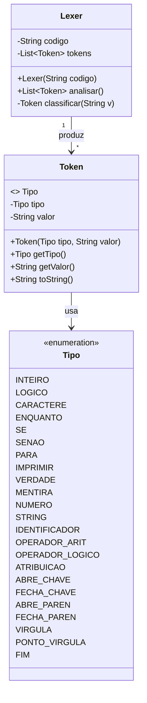

---

## 10. Sequência de Reconhecimento de Token

```mermaid
sequenceDiagram
    participant C as Código
    participant L as Lexer
    participant A as AFD
    participant T as Token
    
    C->>L: "Inteiro x <- 10;"
    L->>L: Remove comentários
    L->>A: Inicia análise
    
    A->>A: Reconhece "Inteiro"
    A->>T: Cria Token(INTEIRO, "Inteiro")
    T-->>L: Token criado
    
    A->>A: Reconhece "x"
    A->>T: Cria Token(IDENTIFICADOR, "x")
    T-->>L: Token criado
    
    A->>A: Reconhece "<-"
    A->>T: Cria Token(ATRIBUICAO, "<-")
    T-->>L: Token criado
    
    A->>A: Reconhece "10"
    A->>T: Cria Token(NUMERO, "10")
    T-->>L: Token criado
    
    A->>A: Reconhece ";"
    A->>T: Cria Token(PONTO_VIRGULA, ";")
    T-->>L: Token criado
    
    L->>T: Adiciona Token(FIM, "")
    L-->>C: Lista de Tokens
```

---

## 11. Máquina de Estados para Palavras-Chave "Inteiro"

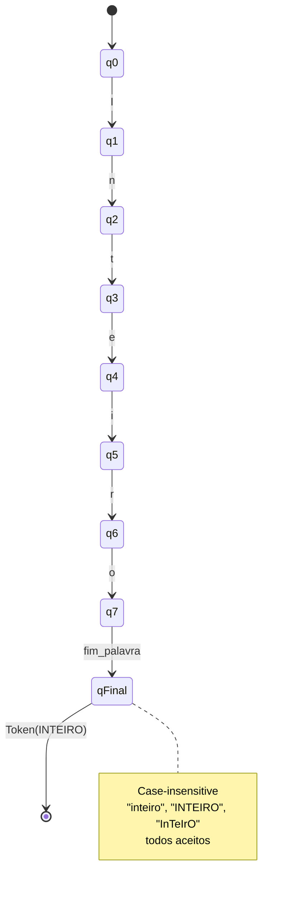

---

## 12. Hierarquia de Reconhecimento de Operadores

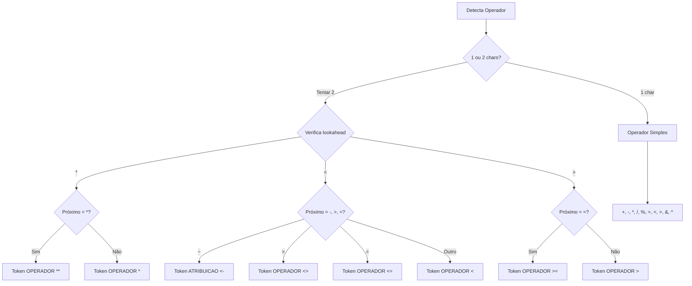

---

## 13. Transições de Estado Completas - Visão Geral

```mermaid
graph LR
    subgraph "Estados Iniciais"
        q0[q0 - Início]
    end
    
    subgraph "Reconhecimento"
        id[Identificador]
        num[Número]
        str[String]
        op[Operador]
        sym[Símbolo]
    end
    
    subgraph "Estados Finais"
        tid[Token ID/Palavra-Chave]
        tnum[Token NUMERO]
        tstr[Token STRING]
        top[Token OPERADOR]
        tsym[Token SIMBOLO]
    end
    
    q0 -->|letra| id
    q0 -->|dígito| num
    q0 -->|"| str
    q0 -->|+ - * / % = < > & ^| op
    q0 -->|{ } ( ) ; ,| sym
    
    id --> tid
    num --> tnum
    str --> tstr
    op --> top
    sym --> tsym
    
    tid --> q0
    tnum --> q0
    tstr --> q0
    top --> q0
    tsym --> q0
```

---

## 14. Exemplo de Análise Passo a Passo

### Entrada: `x <- 5 + 3`

```mermaid
stateDiagram-v2
    direction LR
    [*] --> Estado1: Lê 'x'
    Estado1 --> Estado2: Token(IDENTIFICADOR, x)
    Estado2 --> Estado3: Lê '<-'
    Estado3 --> Estado4: Token(ATRIBUICAO, <-)
    Estado4 --> Estado5: Lê '5'
    Estado5 --> Estado6: Token(NUMERO, 5)
    Estado6 --> Estado7: Lê '+'
    Estado7 --> Estado8: Token(OPERADOR_ARIT, +)
    Estado8 --> Estado9: Lê '3'
    Estado9 --> Estado10: Token(NUMERO, 3)
    Estado10 --> [*]: Token(FIM)
```

---

## 15. Pipeline Completo do Compilador

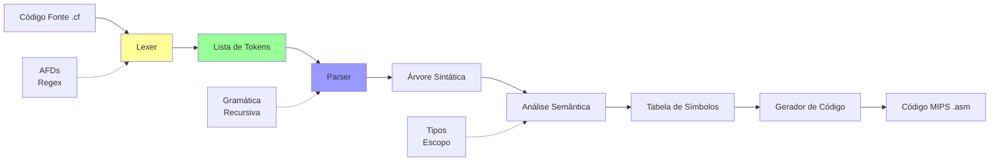

---

## 16. Comparação de Poder Computacional

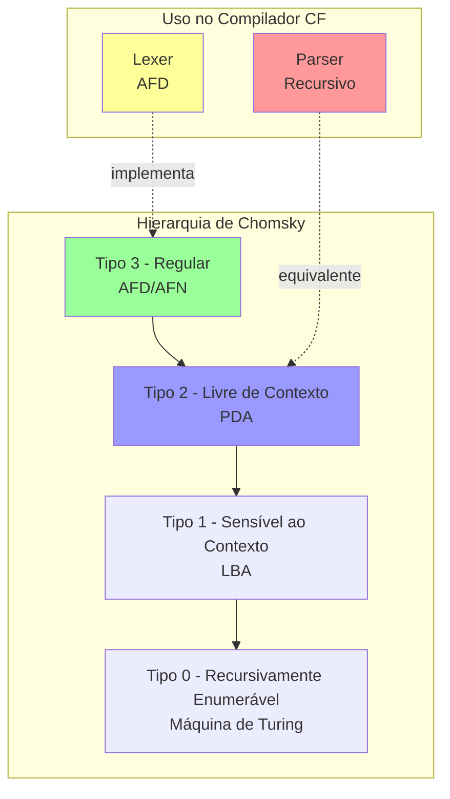

---

## 17. Autômato com Tratamento de Erros

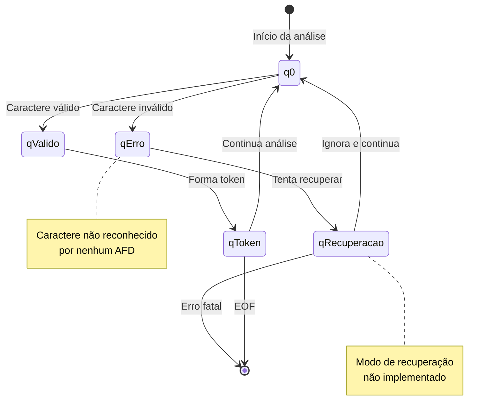

---

## 18. Grafo de Dependências entre Componentes

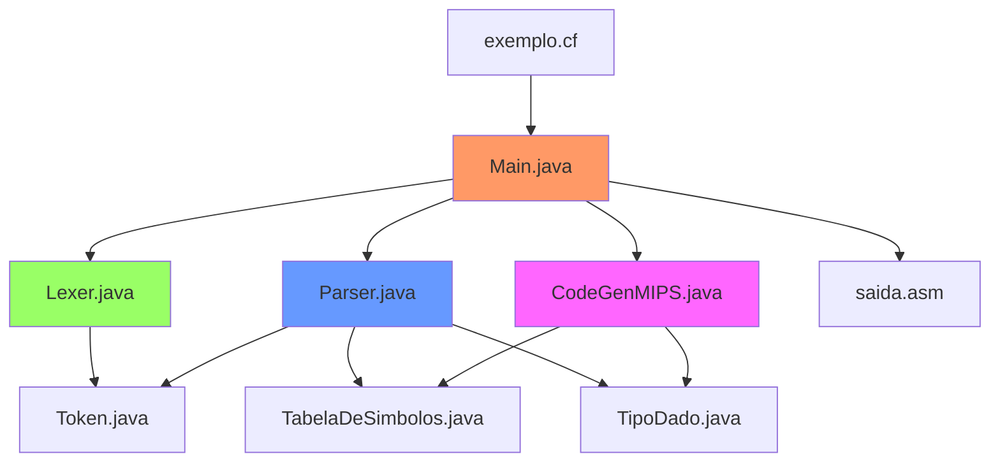

---

## 📝 Notas sobre os Diagramas

### Legenda de Símbolos

- **`[*]`**: Estado inicial ou final
- **`(q0)`**: Estado normal
- **`((q1))`**: Estado de aceitação (final)
- **`qErro`**: Estado de erro
- **Setas**: Transições entre estados
- **Labels nas setas**: Condição para transição

### Convenções

- **AFD**: Autômato Finito Determinístico (uma transição por símbolo)
- **AFN**: Autômato Finito Não-determinístico (múltiplas transições possíveis)
- **PDA**: Autômato com Pilha (usado em parsers)

---

## 🔧 Ferramentas Recomendadas

1. **Mermaid Live Editor**: https://mermaid.live/
2. **VSCode Extension**: Markdown Preview Mermaid Support
3. **GitHub**: Renderização nativa de diagramas Mermaid
4. **Draw.io**: Para diagramas mais complexos

---

*Documentação gerada para o projeto Compilador CF - 2025*

